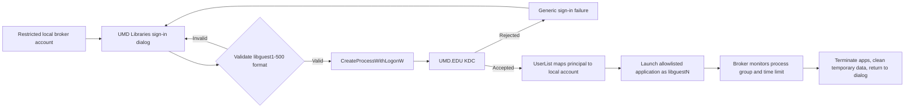

# LibGuest Session Broker for Entra-Only Devices

> [!info] Status: working, packaged for Intune, awaiting pilot deployment
> This approach does not create a true Windows interactive sign-in for the patron.
> It authenticates the SIMS-issued credential and launches approved applications
> under the mapped `libguestN` security context inside an already signed-in local
> broker session. That ceiling is inherent — see "Important limitation" below.

## Repository layout

| Path | Contents |
|---|---|
| [`Deployment/`](./Deployment/) | Intune Win32 packaging. `Package/` is the `.intunewin` source and the canonical home of every shipped file. |
| [`Deployment/Package/Prototype/`](./Deployment/Package/Prototype/) | The broker itself: gate, WPF dialog, `CreateProcessWithLogonW` wrapper, session watcher. |
| [`Deployment/Package/Containment/`](./Deployment/Package/Containment/) | Device configuration run by the installer: guest lockdown, Edge policy, auto-start. |
| [`Containment/`](./Containment/) | Runbooks and the Shell Launcher fallback. Documentation only — not packaged. |
| [`Tests/`](./Tests/) | Development harnesses. `Test-BrokerConfiguration.ps1` runs anywhere; `Test-BrokerLaunch.ps1` needs Windows. |

## Where this stands — 2026-07-27

**Version `0.3.2`. Functionally complete for initial deployment, packaged for
Intune, not yet deployed beyond the pilot device.**

The broker lives in
[`Deployment/Package/Prototype`](./Deployment/Package/Prototype/) and ships as a
single Intune Win32 app that configures the whole device — see
[`Deployment/README.md`](./Deployment/README.md).

### Validated on hardware — `LIBR8ZCBLK4`

| Date | Test | Result |
|---|---|---|
| 07-26 | C# compiles under Windows PowerShell 5.1 CodeDOM | Pass |
| 07-26 | Local test account via `Test-BrokerLaunch.ps1` | Native layer, `SecureString` marshalling, token readback all correct |
| 07-26 | **`libguest115@UMD.EDU` + live SIMS password** | **Token resolved to local `LIBR8ZCBLK4\libguest115`, SID `…-1115`** |
| 07-26 | Job cleanup — broker killed with child running | Child terminated with it |
| 07-27 | Full broker in a real Guest session | Gate, fullscreen dialog, and authentication all correct; wrong passwords and out-of-range numbers rejected |
| 07-27 | Guest session lockdown policy | Win+X hotkeys, Task Manager, Run all dead |

The 07-26 SIMS row is the one that mattered: it proved a machine with **no domain
join and no on-prem AD** can authenticate an MIT Kerberos principal against
UMD.EDU and have `UserList` map it to the correct local account. That was the
assumption the entire Entra-only approach rested on.

### Decisions made along the way

- **The broker is an accountability gate, not a security boundary** (07-27). Patrons
  check out `libguestN` accounts against their ID and the accounts expire weekly, so
  traceability lives in SIMS. This set the containment bar — see
  [Containment model](#containment-model). Shell Launcher remains drafted as the
  fallback if that ever changes.
- **`LaunchAndExit` over supervised sessions.** The broker authenticates, launches
  Edge, and exits. Returning to the dialog every time Edge closed was more
  disruptive than useful. Costs the per-session timer and deterministic cleanup;
  `Mode: Session` still implements those if wanted.
- **Session accountability moved to a CSV** rather than the redacted `broker.log`.
  Append-only for guests, so rows cannot be rewritten or erased from a guest
  session.

### Still open

- [ ] **[Edge containment tests](./Containment/EdgeEscapeTests.md)** — the 40-item
      escape checklist has not been run. Most likely failures are the print path
      and multi-process cleanup.
- [ ] **Multi-process job cleanup.** Proven for a single child (`notepad.exe`);
      Chromium spawns a tree and some launchers break away from job objects.
- [ ] **`sessions.csv` retention policy.** The file names patron accounts with
      timestamps — a patron activity record.
- [ ] **Profile accumulation.** `LOGON_WITH_PROFILE` creates a profile per
      `libguestN` and nothing removes them.
- [ ] **Pilot deployment**, then fleet.

### Not verified

The append-only ACL on `sessions.csv` and the `FILE_APPEND_DATA` write path have
only been reasoned about, not exercised on Windows. Confirm a `SignIn` row appears
after the first pilot guest session; `broker.log` records the reason if it fails.

### How it behaves

The broker starts silently at every logon, examines the current session, and opens
the dialog only when all configured conditions pass:

- The current identity is a local account.
- Shared PC registry configuration is present.
- The username matches `^shpc[a-z0-9]+$`.
- Optional (`RequireGuestsGroup`, default off): the identity is a member of the
  built-in Guests group (`S-1-5-32-546`).

The `shpc` name prefix is an observed Windows Shared PC implementation detail, not
a Microsoft-documented contract. A 2026-07-26 probe on a configured public device
(`LIBR8ZCBLK4`) observed the account `shpctac0ffef`: the suffix is random
alphanumeric, not numeric, and the account is a member of built-in Users — not
Guests — on that build. `RequireGuestsGroup` therefore ships disabled; re-probe
before enabling it. Validate the gate on each new Windows build before registering
the prototype for automatic startup.

To diagnose a device, run the broker with `-ProbeOnly` from a session created by
selecting **Guest**. It writes sanitized session markers and launch prerequisites
as JSON without showing any UI:

```powershell
powershell.exe -ExecutionPolicy Bypass -NoProfile `
  -File 'C:\ProgramData\LibGuestSessionBroker\Prototype\Start-LibGuestSessionBroker.ps1' -ProbeOnly
```

- Guest session: `IsGuestSession` is `true`.
- Domain/Entra session: `IsGuestSession` is `false`.
- `SecondaryLogonUsable` must be `true` — `CreateProcessWithLogonW` is backed by
  the Secondary Logon service, which several hardening baselines disable.

Preview on a development computer requires setting `AllowDevelopmentOverrides` to
`true` in a local copy of `broker-settings.json`; `-ForceGuestUi` is logged and
ignored without it. The Intune installer **refuses to install** a package with that
flag set, so a shipped package cannot present a credential prompt outside the gate.

The broker is registered as a machine-wide startup entry, so it runs at every
logon. Non-guest sessions fail the gate and exit silently without a window.

## Objective

Preserve the familiar `libguestN@UMD.EDU` + SIMS password workflow on an
Entra-only public computer without putting the patron directly through the Entra
lock-screen credential provider.

The patron would see a clean UMD Libraries dialog instead of a console window:

1. The computer signs in to a restricted local standard account used only to run
   the broker interface.
2. The dialog asks for a guest number and SIMS password.
3. The broker validates the format and attempts to launch an approved application
   using the guest credential.
4. A successful launch proves the KDC accepted the credential and runs the child
   process as the mapped local `libguestN` account.
5. Ending the broker-controlled process set returns the computer to the welcome
   dialog and performs session cleanup.

## Important limitation

`runas` and `CreateProcessWithLogonW` launch a process with another user's token;
they do **not** replace the identity of the Windows session that is already signed
in. The broker account still owns the interactive session, window station, desktop,
and shell.

This approach is therefore suitable for an allowlisted application experience,
such as a browser plus a small set of library applications. It is not a safe or
complete replacement for a normal full Windows desktop logon. Trying to start
`explorer.exe` as another user inside the broker's desktop creates ambiguous
profile, shell, clipboard, process-ownership, and cleanup boundaries. If a normal
desktop is required, use the standalone credential-provider approach instead.

## Containment model

> [!important] Decision, 2026-07-27: the broker is an **accountability gate**, not
> a security boundary.
> Patrons check out a `libguestN` SIMS account against their ID, and the account
> expires weekly. Traceability therefore lives in SIMS, not in desktop lockdown.
> The purpose of the dialog is to make sessions attributable and time-limited — not
> to make a desktop unreachable.
>
> This is the decision that sets the containment bar. Revisit it, not the
> implementation, if the requirement ever changes.

### Why that matters

A fullscreen topmost dialog is not a lock. `Win+D` minimises it in one keystroke
and no ordinary application can block that; Task Manager can end it; the Start menu
draws above it; `Ctrl+Alt+Del` is reserved by Windows and cannot be intercepted;
and there is a gap between logon and the broker's first paint where the desktop is
plainly visible.

But the cost of a patron getting behind it is low. The Shared PC guest account is
unprivileged, holds no other user's data, is wiped at sign-out, and rotates every
session. Someone who bypasses the dialog gets an unauthenticated session on a
disposable sandbox — a policy failure, not a breach.

### Chosen implementation

| Layer | Mechanism | What it does |
|---|---|---|
| Presentation | `MainWindow.xaml` — maximized, `WindowStyle="None"`, `Topmost`, close cancelled | Covers the desktop; removes the close button and Alt+F4 |
| Policy | [`Set-GuestSessionLockdown.ps1`](./Deployment/Package/Containment/Set-GuestSessionLockdown.ps1) | Removes Win+X hotkeys, Task Manager, Run, Control Panel, regedit, cmd |
| Application | [`Set-EdgeContainmentPolicy.ps1`](./Deployment/Package/Containment/Set-EdgeContainmentPolicy.ps1) | Privacy between patrons; reduces browser escape surface |

The guest accounts rotate and have no Entra identity, so no user-targeted Intune
profile can reach them. The lockdown script therefore writes into the Default user
hive (`C:\Users\Default\NTUSER.DAT`), which every newly created guest profile
inherits, and the Edge policy is written to HKLM.

`Ctrl+Alt+Del` remains reachable by design. That is the accepted residual.

### Fallback if the bar ever rises

If desktop access must become genuinely impossible, the structural answer is
**Shell Launcher**: with `explorer.exe` never started there is no desktop to reach.
That work is drafted and ready in
[`Containment/Deploy-ShellLauncher.md`](./Containment/Deploy-ShellLauncher.md) and
[`Containment/ShellLauncher-LibGuest.xml`](./Containment/ShellLauncher-LibGuest.xml),
including the `<AutoLogonAccount/>` model that avoids storing a broker credential.

It is not the current plan because it costs an Enterprise/Education edition
requirement, a compiled signed broker, an exit-code contract that can boot-loop a
device if wrong, and the loss of the Shared PC guest flow — all to raise a bar that
the threat model does not require.

### The one hole worth closing regardless

Once a browser runs as `libguestN`, its own file dialogs, `file://` URLs, `Ctrl+O`,
downloads folder, and "open containing folder" actions provide filesystem browsing
the broker cannot intercept. Even under an accountability model, the privacy half
matters — forced InPrivate, no saved passwords, no browser sign-in — because that
governs what one patron leaves behind for the next. See
[`Containment/EdgeEscapeTests.md`](./Containment/EdgeEscapeTests.md).

## Do not automate `runas.exe`

The existing successful test is valuable:

```powershell
runas /user:libguestN@UMD.EDU cmd.exe
```

It demonstrates that external-realm authentication and the Kerberos `UserList`
mapping work on the Entra-only device. It should remain a diagnostic test, not the
production implementation.

Do not attempt to pipe a password into `runas.exe`, automate its console prompt, or
use `/savecred`. Those designs are brittle and can expose or persist guest
credentials.

The front end should call the Windows API directly:

- Preferred proof-of-concept API: `CreateProcessWithLogonW`
- Username: `libguestN@UMD.EDU`
- Domain parameter: `NULL` when using UPN format
- Logon flag: `LOGON_WITH_PROFILE`
- Application: an absolute path selected from a compiled allowlist
- Command line: fixed by the application, never supplied by the patron

Microsoft documents that this API authenticates the supplied credentials, creates
a process under that security context, and can load the target user's profile. It
also handles the password as plaintext at the API boundary, so the application must
minimize its lifetime and clear unmanaged buffers immediately.

Reference: [CreateProcessWithLogonW](https://learn.microsoft.com/windows/win32/api/winbase/nf-winbase-createprocesswithlogonw)

## Proposed architecture



### Components

1. **Restricted broker account**
   - Local standard user, not an Entra identity.
   - Automatically signs in or is configured as an Assigned Access/custom-shell
     account.
   - Has no access to administrative tools, local data from previous sessions,
     PowerShell, Command Prompt, Registry Editor, or arbitrary executables.

2. **Modern dialog**
   - Recommended first implementation: C#/.NET 8 WPF for deployment simplicity.
   - Possible later implementation: WinUI 3 if the additional packaging complexity
     is justified by the visual result.
   - Username field accepts a number or `libguestN`; the program constructs the
     complete principal.
   - Password field never logs, caches, or displays its contents.
   - Shows generic authentication errors so it does not disclose account state.

3. **Process launcher**
   - P/Invoke `CreateProcessWithLogonW` for the proof of concept.
   - A native C++ launcher can be considered for production to reduce managed
     plaintext-password lifetime.
   - Use a non-System caller. Microsoft documents that
     `CreateProcessWithLogonW` cannot be called by a LocalSystem process on current
     Windows versions; a System service would require the more complex
     `LogonUser` + `CreateProcessAsUser` design.
   - Close process and thread handles after use.
   - Create a job object so broker-launched processes can be tracked and terminated
     together.

4. **Session controller**
   - Enforces the reservation duration.
   - Prevents a second launch while a session is active.
   - Terminates the complete broker-owned process tree at session end.
   - Clears browser data, downloads, print artifacts, and other configured temporary
     content.
   - Returns to the sign-in dialog without exposing the broker desktop.

## Security requirements

- Fix the existing LibGuest installer before testing: reset the SAM password of
  every existing `libguestN` account so no account retains the legacy shared local
  password.
- Allow only `libguest1` through `libguest500`; reject all other identity strings.
- Never accept an executable path or command-line arguments from the user.
- Never use `/savecred`, Credential Manager, a configuration file, the registry, or
  DPAPI to retain the SIMS password.
- Do not place the password in process arguments, environment variables, transcript
  logs, crash reports, or telemetry.
- Clear the UI password and unmanaged password buffer immediately after the API
  call.
- Use Authenticode signing and a WDAC/App Control allow policy for the broker and
  approved applications.
- Have CrowdStrike and Rapid7 review the design and pilot binaries.
- Keep a Windows LAPS-managed recovery administrator and escrowed BitLocker key.
- Display an acceptable-use/privacy notice before authentication.

## Proof-of-concept plan

> [!note] Retained as the original plan and its outcome.
> Phases 0 and 1 are complete and validated on hardware. Phase 2 is partly done —
> Edge launches correctly, but the containment checklist has not been run. Phase 3
> was **superseded** by the 2026-07-27 accountability-gate decision: instead of
> replacing the shell, the deployment covers the desktop and removes the obvious
> ways around it. See [Containment model](#containment-model).

### Phase 0 - Confirm prerequisites — complete

On one disposable Entra-only VM or test machine:

```powershell
dsregcmd /status
Resolve-DnsName -Type SRV _kerberos._tcp.umd.edu
Test-NetConnection famine.umd.edu -Port 88
Get-LocalUser libguest1
Get-ItemProperty 'HKLM:\SYSTEM\CurrentControlSet\Control\Lsa\Kerberos\UserList' -Name 'libguest1@UMD.EDU'
runas /user:libguest1@UMD.EDU cmd.exe
```

Do not continue unless the final test succeeds with a live SIMS password.

### Phase 1 - Authentication launcher — complete

**Validated on `LIBR8ZCBLK4` 2026-07-26 with a live SIMS credential.**

The dialog:

1. Accepts `1` through `500` and constructs `libguestN@UMD.EDU`.
2. Accepts a password through a masked password field.
3. Calls `CreateProcessWithLogonW` with `LOGON_WITH_PROFILE` and a `NULL` domain.
4. Launches one fixed allowlisted application.
5. Reports success or a generic failure without logging the credential.
6. Clears password memory and closes all handles.

Verify that the launched process token resolves to the expected local
`libguestN` identity and that its profile is the expected profile.

Two implementation choices differ from the original sketch, both deliberately:

- **The identity check reads the process token directly** rather than redirecting
  `whoami.exe` output to a protected location. Redirecting output requires handle
  inheritance across the logon boundary and a file location writable by the guest
  but not tamperable by it — which conflicts with locking down the broker
  directory. `OpenProcessToken` on the returned handle answers the same question
  with less machinery and no writable artifact.
- **The process is created with `CREATE_SUSPENDED`.** This removes the race against
  a short-lived process exiting before its token can be read, allows job-object
  assignment before any guest code runs, and lets the identity test prove the
  credential authenticated and mapped without executing a single instruction as the
  guest.

### Phase 2 - One allowlisted GUI application

Launch a single browser or library application. Test:

- HKCU and profile behavior
- downloads and temporary files
- printing
- clipboard behavior
- child processes
- application updates
- graceful and forced termination
- offline/KDC-unreachable behavior

### Phase 3 - Restricted broker shell — superseded

Replacing the shell was the plan while the broker was assumed to be a security
boundary. The 2026-07-27 decision reframed it as an accountability gate, so the
shipped design covers the desktop and strips the obvious ways around it instead.

What shipped in its place:

- Fullscreen topmost dialog with no close button; Alt+F4 cancelled.
- Guest session policy removing Win+X hotkeys, Task Manager, Run, Control Panel,
  regedit, and cmd.
- Machine-wide startup entry, gated so non-guest sessions exit silently.
- Job-object process tracking and a session timer — implemented, and used by
  `Mode: Session`. The shipped `LaunchAndExit` mode trades both away for a broker
  that gets out of the patron's way.

Still available if the bar rises:
[`Containment/Deploy-ShellLauncher.md`](./Containment/Deploy-ShellLauncher.md).

## Go/no-go criteria

Proceed only if all of the following are true:

- Every patron application can run correctly as a child process under the mapped
  account.
- No broker-account data or UI becomes accessible.
- All child processes can be identified and terminated reliably.
- User data is removed at the end of every session.
- Passwords are absent from logs, dumps, command lines, and stored credentials.
- Security approves the mixed-identity desktop design.

Stop this approach and use the credential provider if patrons need Explorer as a
normal shell, applications escape process supervision, identity boundaries are
unclear, or cleanup cannot be proven.

## Intune package

**Built.** Full packaging and deployment instructions are in
[`Deployment/README.md`](./Deployment/README.md). What follows is the reasoning
behind its design, and the one requirement still outstanding.

The configuration file may contain only nonsecret settings such as application
allowlists, session duration, branding, and log location. It must never contain a
password or reusable credential.

Because the broker's behavior is entirely driven by that file, the installer breaks
ACL inheritance on the install root and grants `Users` read-and-execute only. A
broker-session account with write access to `broker-settings.json` could widen
`AllowedApplicationRoots` or point `Applications` at an arbitrary binary, which
then runs against a live SIMS credential.

Detection uses a registry sentinel written at the end of a successful install, not
a file rule — most of what this app does is policy and ACLs rather than files, so a
file rule would report success as soon as the copy finished.

> [!warning] Outstanding: the shipping broker should be a signed compiled executable.
> `Add-Type` produces a dynamically compiled assembly, which is precisely what the
> required WDAC / App Control policy blocks. The PowerShell form is deployable
> today because WDAC is not yet enforced on these devices; it must be replaced
> before that changes.

Two log files, deliberately separate:

| File | Contents | Guest access |
|---|---|---|
| `broker.log` | Event identifiers, timestamps, launches, sanitized Windows error codes. Guest principals **redacted** unless `LogGuestPrincipal` is enabled. | Modify |
| `sessions.csv` | Accountability record: which `libguestN` authenticated, when, and for how long. Names accounts **by design**. | Append only |

`sessions.csv` is a patron activity record and needs an approved retention policy
before wide deployment.

## Decision summary

This is worth prototyping because the existing `runas` success shows that Windows
can authenticate the MIT Kerberos principal on the Entra-only machine. The safe
production form is not a hidden `runas.exe`; it is a restricted broker UI calling a
Windows logon/process API with a fixed application allowlist.

Its ceiling is an application session—not a true Windows desktop session. The
credential provider is the appropriate path when that ceiling is too restrictive.
