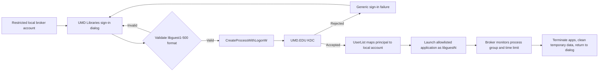

# LibGuest Session Broker for Entra-Only Devices

> [!warning] Status: concept and proof of concept only
> This approach does not create a true Windows interactive sign-in for the patron.
> It authenticates the SIMS-issued credential and launches approved applications
> under the mapped `libguestN` security context inside an already signed-in local
> broker session.

## Current development status

Version `0.1.0` of the guest-session launch gate and WPF dialog shell is in
[`Prototype`](./Prototype/). It does not authenticate or launch applications yet.

The prototype starts silently, examines the current session, and opens the dialog
only when all configured conditions pass:

- The current identity is a local account.
- Shared PC registry configuration is present.
- The username matches `^shpc\d+$`.

The `shpc####` name is an observed Windows Shared PC implementation detail, not a
Microsoft-documented contract. Validate it on a configured public device before
registering the prototype for automatic startup.

From a PowerShell prompt running inside a session created by selecting **Guest**:

```powershell
Set-Location '<path-to-Prototype>'
.\Start-LibGuestSessionBroker.ps1 -ProbeOnly
```

Run the same probe after signing in through the **Domain** option. Expected result:

- Guest session: `IsGuestSession` is `true`.
- Domain/Entra session: `IsGuestSession` is `false`.

To preview the dialog on a development computer without satisfying the gate:

```powershell
.\Start-LibGuestSessionBroker.ps1 -ForceGuestUi
```

Do not deploy it as an automatic startup item until both probe outputs have been
reviewed. The intended production design is a machine-wide startup entry whose
launcher performs this gate before creating any window; domain users may start the
launcher process briefly, but it exits silently and displays no UI.

## Objective

Preserve the familiar `libguestN@UMD.EDU` + SIMS password workflow on an
Entra-only public computer without putting the patron directly through the Entra
lock-screen credential provider.

The patron would see a clean UMD Libraries dialog instead of a console window:

1. The computer signs in to a restricted local standard account used only to run
   the broker interface.
2. The dialog asks for a guest number and SIMS password.
3. The broker validates the format and attempts to launch an approved application
   using the guest credential.
4. A successful launch proves the KDC accepted the credential and runs the child
   process as the mapped local `libguestN` account.
5. Ending the broker-controlled process set returns the computer to the welcome
   dialog and performs session cleanup.

## Important limitation

`runas` and `CreateProcessWithLogonW` launch a process with another user's token;
they do **not** replace the identity of the Windows session that is already signed
in. The broker account still owns the interactive session, window station, desktop,
and shell.

This approach is therefore suitable for an allowlisted application experience,
such as a browser plus a small set of library applications. It is not a safe or
complete replacement for a normal full Windows desktop logon. Trying to start
`explorer.exe` as another user inside the broker's desktop creates ambiguous
profile, shell, clipboard, process-ownership, and cleanup boundaries. If a normal
desktop is required, use the standalone credential-provider approach instead.

## Do not automate `runas.exe`

The existing successful test is valuable:

```powershell
runas /user:libguestN@UMD.EDU cmd.exe
```

It demonstrates that external-realm authentication and the Kerberos `UserList`
mapping work on the Entra-only device. It should remain a diagnostic test, not the
production implementation.

Do not attempt to pipe a password into `runas.exe`, automate its console prompt, or
use `/savecred`. Those designs are brittle and can expose or persist guest
credentials.

The front end should call the Windows API directly:

- Preferred proof-of-concept API: `CreateProcessWithLogonW`
- Username: `libguestN@UMD.EDU`
- Domain parameter: `NULL` when using UPN format
- Logon flag: `LOGON_WITH_PROFILE`
- Application: an absolute path selected from a compiled allowlist
- Command line: fixed by the application, never supplied by the patron

Microsoft documents that this API authenticates the supplied credentials, creates
a process under that security context, and can load the target user's profile. It
also handles the password as plaintext at the API boundary, so the application must
minimize its lifetime and clear unmanaged buffers immediately.

Reference: [CreateProcessWithLogonW](https://learn.microsoft.com/windows/win32/api/winbase/nf-winbase-createprocesswithlogonw)

## Proposed architecture



### Components

1. **Restricted broker account**
   - Local standard user, not an Entra identity.
   - Automatically signs in or is configured as an Assigned Access/custom-shell
     account.
   - Has no access to administrative tools, local data from previous sessions,
     PowerShell, Command Prompt, Registry Editor, or arbitrary executables.

2. **Modern dialog**
   - Recommended first implementation: C#/.NET 8 WPF for deployment simplicity.
   - Possible later implementation: WinUI 3 if the additional packaging complexity
     is justified by the visual result.
   - Username field accepts a number or `libguestN`; the program constructs the
     complete principal.
   - Password field never logs, caches, or displays its contents.
   - Shows generic authentication errors so it does not disclose account state.

3. **Process launcher**
   - P/Invoke `CreateProcessWithLogonW` for the proof of concept.
   - A native C++ launcher can be considered for production to reduce managed
     plaintext-password lifetime.
   - Use a non-System caller. Microsoft documents that
     `CreateProcessWithLogonW` cannot be called by a LocalSystem process on current
     Windows versions; a System service would require the more complex
     `LogonUser` + `CreateProcessAsUser` design.
   - Close process and thread handles after use.
   - Create a job object so broker-launched processes can be tracked and terminated
     together.

4. **Session controller**
   - Enforces the reservation duration.
   - Prevents a second launch while a session is active.
   - Terminates the complete broker-owned process tree at session end.
   - Clears browser data, downloads, print artifacts, and other configured temporary
     content.
   - Returns to the sign-in dialog without exposing the broker desktop.

## Security requirements

- Fix the existing LibGuest installer before testing: reset the SAM password of
  every existing `libguestN` account so no account retains the legacy shared local
  password.
- Allow only `libguest1` through `libguest500`; reject all other identity strings.
- Never accept an executable path or command-line arguments from the user.
- Never use `/savecred`, Credential Manager, a configuration file, the registry, or
  DPAPI to retain the SIMS password.
- Do not place the password in process arguments, environment variables, transcript
  logs, crash reports, or telemetry.
- Clear the UI password and unmanaged password buffer immediately after the API
  call.
- Use Authenticode signing and a WDAC/App Control allow policy for the broker and
  approved applications.
- Have CrowdStrike and Rapid7 review the design and pilot binaries.
- Keep a Windows LAPS-managed recovery administrator and escrowed BitLocker key.
- Display an acceptable-use/privacy notice before authentication.

## Proof-of-concept plan

### Phase 0 - Confirm prerequisites

On one disposable Entra-only VM or test machine:

```powershell
dsregcmd /status
Resolve-DnsName -Type SRV _kerberos._tcp.umd.edu
Test-NetConnection famine.umd.edu -Port 88
Get-LocalUser libguest1
Get-ItemProperty 'HKLM:\SYSTEM\CurrentControlSet\Control\Lsa\Kerberos\UserList' -Name 'libguest1@UMD.EDU'
runas /user:libguest1@UMD.EDU cmd.exe
```

Do not continue unless the final test succeeds with a live SIMS password.

### Phase 1 - Authentication launcher

Build a minimal WPF dialog that:

1. Accepts `1` through `500` and constructs `libguestN@UMD.EDU`.
2. Accepts a password through a masked password field.
3. Calls `CreateProcessWithLogonW` with `LOGON_WITH_PROFILE`.
4. Launches one fixed harmless application, initially `whoami.exe` with output
   redirected to a protected test location or a small signed identity-test program.
5. Reports success or a generic failure without logging the credential.
6. Clears password memory and closes all handles.

Verify that the launched process token resolves to the expected local
`libguestN` identity and that its profile is the expected profile.

### Phase 2 - One allowlisted GUI application

Launch a single browser or library application. Test:

- HKCU and profile behavior
- downloads and temporary files
- printing
- clipboard behavior
- child processes
- application updates
- graceful and forced termination
- offline/KDC-unreachable behavior

### Phase 3 - Restricted broker shell

Only after Phase 2 succeeds:

- Configure the local broker account through Assigned Access or a custom shell.
- Remove access to the normal broker desktop.
- Add process job tracking and a session timer.
- Implement deterministic cleanup and a visible emergency sign-out path.
- Package and deploy to a dedicated Intune test-device group.

## Go/no-go criteria

Proceed only if all of the following are true:

- Every patron application can run correctly as a child process under the mapped
  account.
- No broker-account data or UI becomes accessible.
- All child processes can be identified and terminated reliably.
- User data is removed at the end of every session.
- Passwords are absent from logs, dumps, command lines, and stored credentials.
- Security approves the mixed-identity desktop design.

Stop this approach and use the credential provider if patrons need Explorer as a
normal shell, applications escape process supervision, identity boundaries are
unclear, or cleanup cannot be proven.

## Anticipated Intune package

Future package contents should be staged in a clean source directory:

```text
SessionBroker/
├── Install-LibGuestSessionBroker.ps1
├── Uninstall-LibGuestSessionBroker.ps1
├── Detect-LibGuestSessionBroker.ps1
├── LibGuestSessionBroker.exe
└── broker-settings.json
```

The configuration file may contain only nonsecret settings such as application
allowlists, session duration, branding, and log location. It must never contain a
password or reusable credential.

Suggested log location:

```text
C:\ProgramData\LibGuestSessionBroker\broker.log
```

Log event identifiers, timestamps, application launches, session results, and
sanitized Windows error codes only. Do not log usernames if they are considered
patron activity records without an approved retention policy.

## Decision summary

This is worth prototyping because the existing `runas` success shows that Windows
can authenticate the MIT Kerberos principal on the Entra-only machine. The safe
production form is not a hidden `runas.exe`; it is a restricted broker UI calling a
Windows logon/process API with a fixed application allowlist.

Its ceiling is an application session—not a true Windows desktop session. The
credential provider is the appropriate path when that ceiling is too restrictive.
